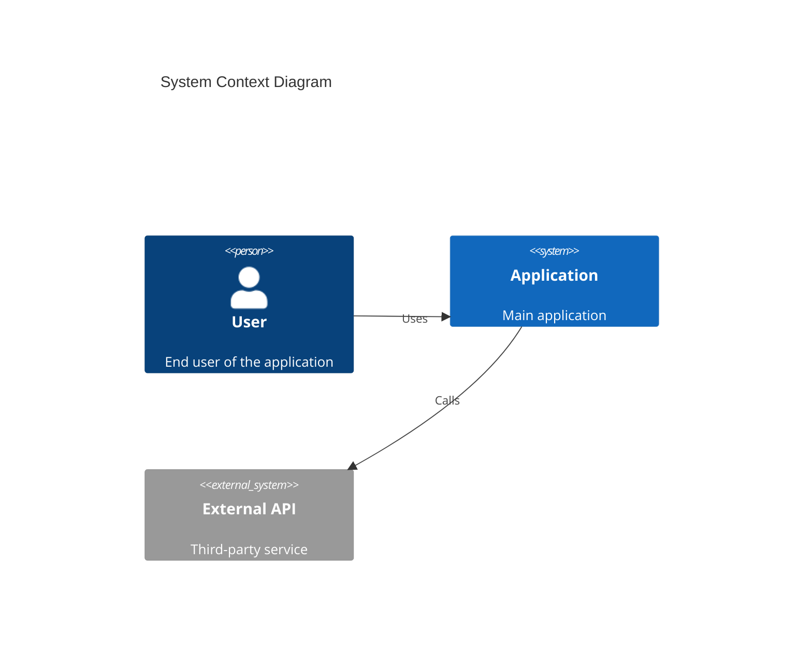
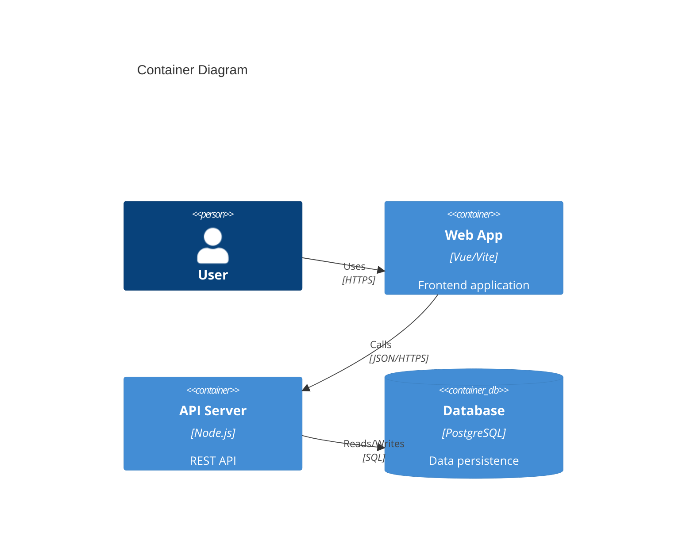
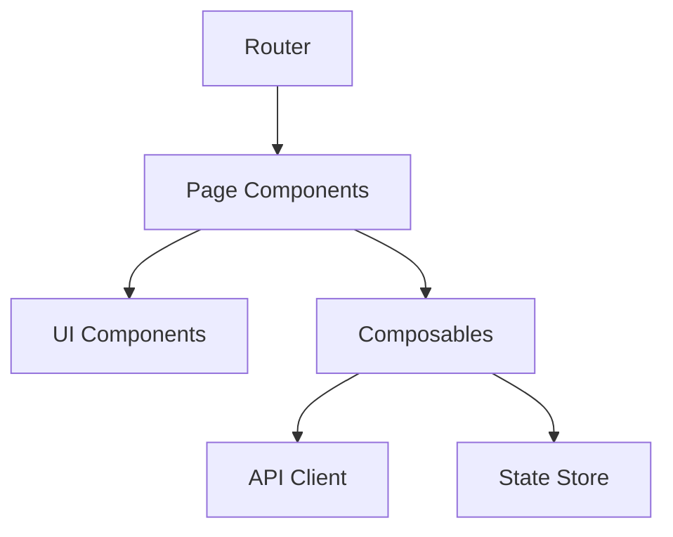
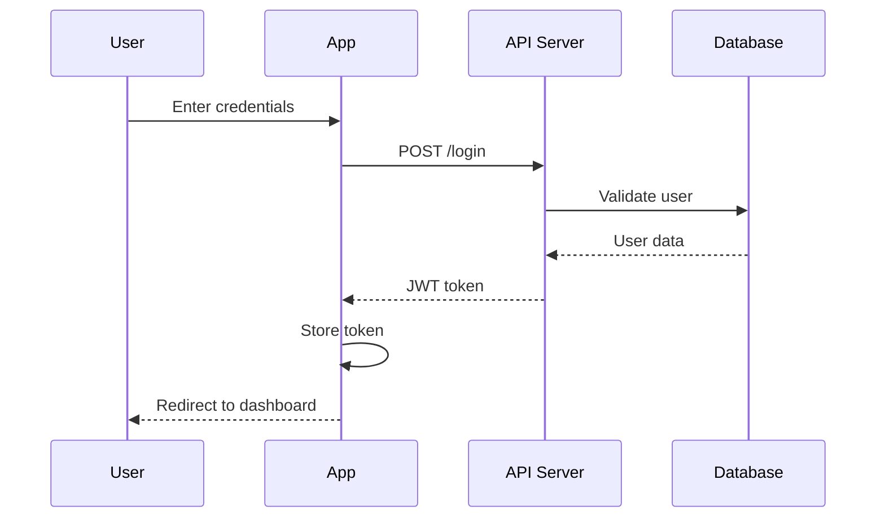
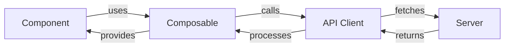

# Codebase Documentation Generator

Use this skill for generating comprehensive, DeepWiki-style documentation from source code and integrating it with VitePress.

## When to Use

**Use this skill when you need to:**
- Generate comprehensive documentation from existing source code
- Create architecture diagrams (C4 Model, flowcharts, class diagrams)
- Set up a VitePress documentation site for your codebase
- Document project structure, workflows, and deep-dive component analysis
- Onboard new developers with structured codebase documentation

**Do not use when:**
- You need API documentation from code comments (use TypeDoc/JSDoc instead)
- The codebase is trivial or very small (< 100 lines)
- You need exact Litho output format or proprietary tools

---

## Workflow

Follow this **5-phase progressive analysis workflow** when generating documentation:

| Phase | Duration | Objective | Output |
|-------|----------|-----------|--------|
| Phase 1 | 5-10 min | Project Discovery | Project overview, tech stack, entry points |
| Phase 2 | 10-20 min | Architecture Analysis | C4 diagrams, module relationships |
| Phase 3 | 20-40 min | Documentation Generation | Markdown files with code examples |
| Phase 4 | 10-15 min | Diagram Generation | Mermaid diagrams for visual representation |
| Phase 5 | 5-10 min | Quality Assurance | Review, validate links, consistency check |

---

## Phase 1: Project Discovery

### Step 1: Understand the codebase structure

```bash
# Analyze project structure
tree -L 3 -I 'node_modules|dist|build|.git'

# Identify main entry points
find . -name "index.ts" -o -name "index.js" -o -name "main.ts" -o -name "main.py" | head -20

# Identify configuration files
ls *.json *.yaml *.yml *.toml 2>/dev/null
```

### Step 2: Identify technology stack

Look for:
- **Language**: TypeScript, JavaScript, Python, Rust, Go, Java, etc.
- **Framework**: React, Vue, Svelte, Django, FastAPI, etc.
- **Build Tool**: Vite, Webpack, Rollup, Cargo, etc.
- **Package Manager**: pnpm, npm, yarn, cargo, pip

### Step 3: Document findings

Create a summary including:
- Project name and purpose
- Main technologies used
- Directory structure overview
- Key entry points and configuration files

---

## Phase 2: Architecture Analysis

### Step 1: Identify architectural patterns

Analyze the codebase for:
- **Module organization** (monolithic, modular, microservices)
- **Design patterns** (MVC, MVVM, Repository, Factory, etc.)
- **Data flow** (unidirectional, bidirectional, event-driven)
- **State management** (Redux, Pinia, Zustand, Context API)

### Step 2: Map component relationships

Create relationship maps:
- Which modules depend on which?
- What are the core abstractions?
- Where are the boundaries between layers?

### Step 3: Define C4 Model levels

Structure your analysis using the **C4 Model**:

| Level | Scope | Diagram Type |
|-------|-------|--------------|
| L1 - System Context | External systems and users | C4Context |
| L2 - Container | Applications and data stores | C4Container |
| L3 - Component | Major structural building blocks | Component diagram |
| L4 - Code (Optional) | Classes, interfaces | Class/ER diagram |

---

## Phase 3: Documentation Generation

### Output Structure

Generate documentation following this structure:

```
docs/
├── 1. Project Overview.md          # High-level summary, tech stack
├── 2. Architecture Overview.md     # C4 diagrams, system design
├── 3. Workflow Overview.md         # Key workflows and data flows
├── 4. Deep Dive/                   # Component-level documentation
│   ├── [Component-Name].md
│   └── ...
└── .vitepress/
    └── config.ts                   # VitePress configuration
```

### Document Templates

#### 1. Project Overview.md

```markdown
# Project Overview

## Summary
Brief description of what this project does.

## Technology Stack

| Category | Technology |
|----------|------------|
| Language | TypeScript |
| Framework | Vue 3 |
| Build Tool | Vite |
| Testing | Vitest |

## Directory Structure

```
src/
├── components/    # UI components
├── composables/   # Reusable logic
├── stores/        # State management
└── utils/         # Utility functions
```

## Entry Points

- **Main**: `src/main.ts`
- **CLI**: `src/cli.ts` (if applicable)
```

#### 2. Architecture Overview.md

```markdown
# Architecture Overview

## System Context (C4 Level 1)



## Container Diagram (C4 Level 2)



## Component Diagram (C4 Level 3)


```

#### 3. Workflow Overview.md

```markdown
# Workflow Overview

## Authentication Flow



## Data Fetching Pattern


```

#### 4. Deep Dive Component.md

```markdown
# [Component Name]

## Purpose
What this component/module does and why it exists.

## Location
`src/path/to/component.ts`

## Public API

### Functions

| Function | Parameters | Return | Description |
|----------|------------|--------|-------------|
| `foo()` | `bar: string` | `void` | Does something |

### Classes/Interfaces

```typescript
interface MyInterface {
  property: string
  method(): void
}
```

## Dependencies

- Depends on: `X`, `Y`
- Used by: `A`, `B`

## Implementation Notes

Key implementation details, algorithms, or patterns used.
```

---

## Phase 4: Diagram Generation

### Mermaid Diagram Types

Use appropriate diagram types for different purposes:

| Purpose | Diagram Type |
|---------|--------------|
| System boundaries | C4Context, C4Container |
| Component relationships | graph TB/LR |
| Data flow | flowchart |
| Method calls | sequenceDiagram |
| State machines | stateDiagram-v2 |
| Database schema | erDiagram |
| Class hierarchy | classDiagram |

### Diagram Guidelines

1. **Keep diagrams focused** - One concept per diagram
2. **Use consistent naming** - Match code naming conventions
3. **Add descriptions** - Explain complex relationships
4. **Limit complexity** - Split large diagrams into smaller ones

---

## Phase 5: Quality Assurance

### Checklist

- [ ] All links between documents are valid
- [ ] Mermaid diagrams render correctly
- [ ] Code examples are syntactically correct
- [ ] Naming is consistent throughout
- [ ] No orphaned or empty documents
- [ ] VitePress config includes all pages

### VitePress Integration

#### Step 1: Set up VitePress

```bash
# Install VitePress
pnpm add -D vitepress

# Initialize
npx vitepress init
```

#### Step 2: Configure docs/.vitepress/config.ts

```typescript
import { defineConfig } from 'vitepress'

export default defineConfig({
  title: 'Project Documentation',
  description: 'Generated codebase documentation',

  themeConfig: {
    nav: [
      { text: 'Overview', link: '/1. Project Overview' },
      { text: 'Architecture', link: '/2. Architecture Overview' },
      { text: 'Workflows', link: '/3. Workflow Overview' },
      { text: 'Deep Dive', link: '/4. Deep Dive/' }
    ],

    sidebar: {
      '/4. Deep Dive/': [
        {
          text: 'Components',
          items: [
            // Auto-generated or manually maintained
          ]
        }
      ]
    }
  },

  markdown: {
    config: (md) => {
      // Enable Mermaid support
    }
  }
})
```

#### Step 3: Add scripts to package.json

```json
{
  "scripts": {
    "docs:dev": "vitepress dev docs",
    "docs:build": "vitepress build docs",
    "docs:preview": "vitepress preview docs"
  }
}
```

---

## Language-Specific Patterns

### TypeScript/JavaScript Projects

- Focus on: modules, exports, types, interfaces
- Entry points: `index.ts`, `main.ts`
- Config: `tsconfig.json`, `package.json`

### Python Projects

- Focus on: packages, modules, classes, decorators
- Entry points: `__main__.py`, `main.py`
- Config: `pyproject.toml`, `requirements.txt`

### Rust Projects

- Focus on: crates, modules, traits, lifetimes
- Entry points: `main.rs`, `lib.rs`
- Config: `Cargo.toml`

### Go Projects

- Focus on: packages, interfaces, goroutines
- Entry points: `main.go`
- Config: `go.mod`

### Java Projects

- Focus on: packages, classes, interfaces, annotations
- Entry points: `Main.java`, `Application.java`
- Config: `pom.xml`, `build.gradle`

---

## References

| Topic | Description | Reference |
|-------|-------------|-----------|
| C4 Model | Visualizing software architecture | [c4-model.md](references/c4-model.md) |
| Mermaid Diagrams | Creating diagrams with text | [mermaid-diagrams.md](references/mermaid-diagrams.md) |
| VitePress Config | Configuring documentation site | [vitepress-config.md](references/vitepress-config.md) |
| Progress Analysis | Incremental codebase analysis | [progressive-analysis.md](references/progressive-analysis.md) |
