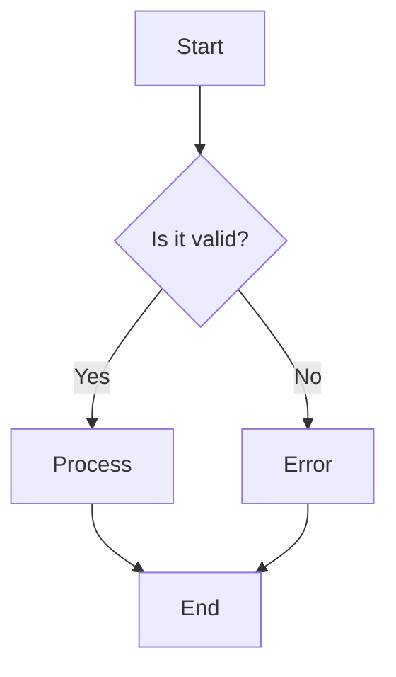
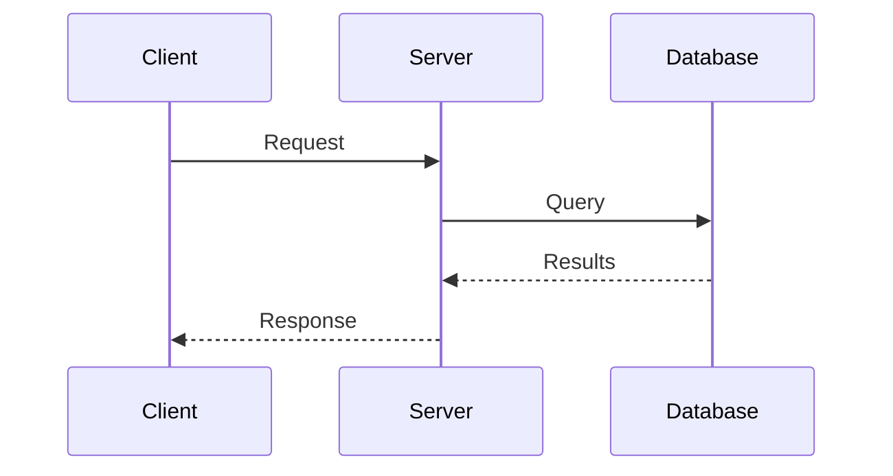
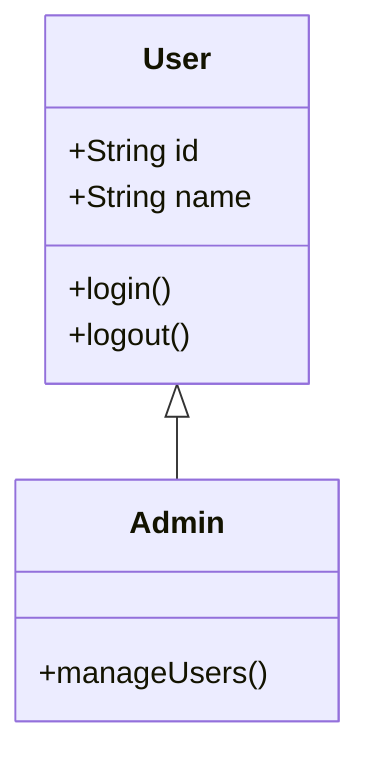
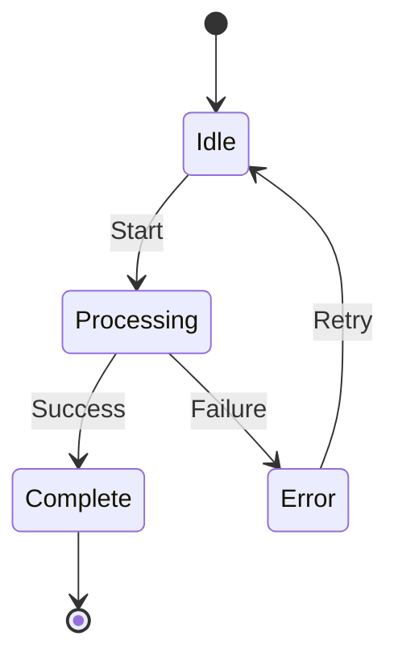
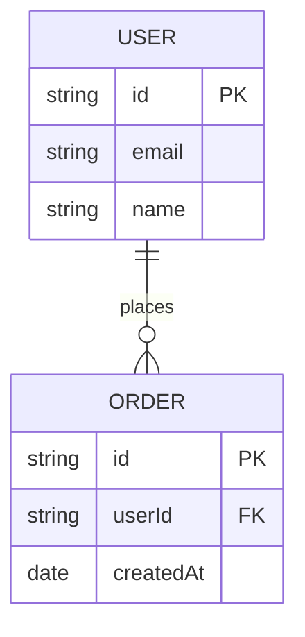
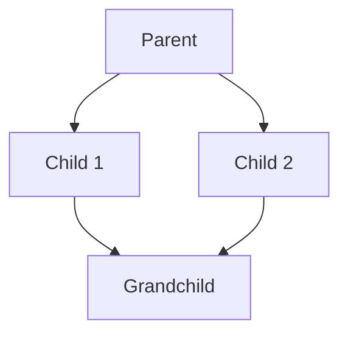
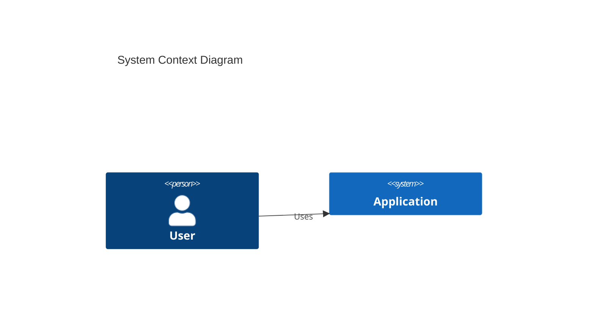
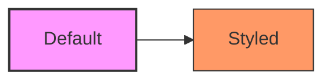

# Mermaid Diagrams

Mermaid allows you to create diagrams using text and code, making version control and maintenance easier.

## Flowchart

For showing process flows and decision points.



**Syntax:**
```markdown
flowchart TD
    A[Start] --> B{Is it valid?}
    B -->|Yes| C[Process]
    B -->|No| D[Error]
```

## Sequence Diagram

For showing interactions between entities over time.



**Syntax:**
```markdown
sequenceDiagram
    participant A as Client
    participant B as Server
    A->>B: Message
    B-->>A: Reply
```

## Class Diagram

For showing class hierarchies and relationships.



## State Diagram

For showing state machines and transitions.



## ER Diagram

For showing database entity relationships.



## Graph

For general directed or undirected relationships.



Direction options:
- `TB` - Top to bottom
- `BT` - Bottom to top
- `LR` - Left to right
- `RL` - Right to left

## C4 Diagrams

For software architecture (requires C4 extension).



## Diagram Best Practices

1. **Keep it simple** - One concept per diagram
2. **Use consistent naming** - Match code naming
3. **Add titles** - Explain what the diagram shows
4. **Limit nodes** - Split if more than 10-15 elements
5. **Use subgraphs** - Group related elements

## Common Notation

| Shape | Syntax | Use For |
|-------|--------|---------|
| Rectangle | `[Text]` | Process, step |
| Diamond | `{Text}` | Decision |
| Circle | `((Text))` | Start/End |
| Database | `[(Text)]` | Data store |
| Subroutine | `[[Text]]` | Predefined process |

## Styling

Apply custom styles:



<!--
Source references:
- https://mermaid.js.org/intro/
- https://mermaid.js.org/syntax/flowchart.html
-->
