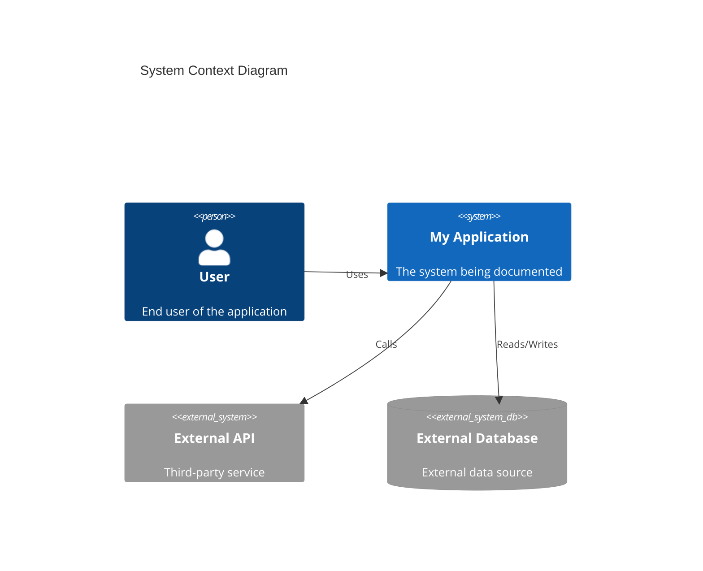
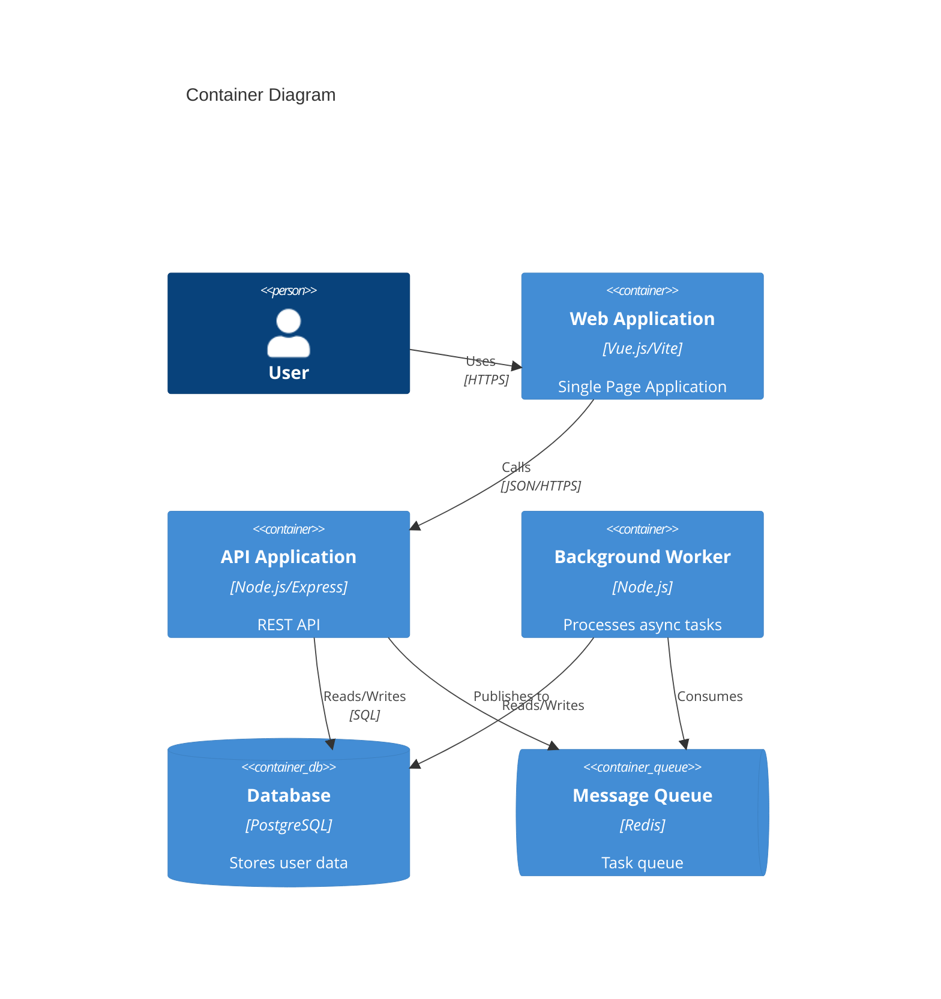
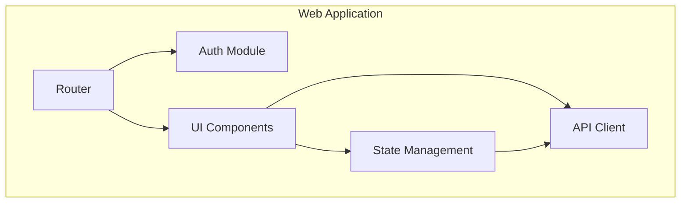

# C4 Model

The C4 model is a simple layered approach for visualizing software architecture at different levels of abstraction. It is the core framework for DeepWiki architecture documentation.

## Overview

The C4 model contains four levels:

1. **Context** (Level 1) - The system in its environment
2. **Container** (Level 2) - High-level technology building blocks
3. **Component** (Level 3) - Structural building blocks within containers
4. **Code** (Level 4) - Implementation details (optional)

## Level 1: System Context

Shows the system as a central box surrounded by users and other systems it interacts with.

**Focus**: Who uses the system? What external dependencies exist?

## Level 2: Container

Shows high-level technology choices, responsibility distribution, and how containers communicate.

**Focus**: What are the main applications and data stores? How do they interact?

## Level 3: Component

Shows components within a single container and their interactions.

**Focus**: What are the main structural parts? What are their responsibilities?

## Level 4: Code (Optional)

Shows implementation details - classes, interfaces, etc. Usually only needed for complex areas.

**Focus**: How is it implemented? What are the key classes?

## Best Practices

1. **Start from Level 1** - Always begin with the big picture
2. **Drill down as needed** - Not every system needs all 4 levels
3. **Keep diagrams updated** - Update when architecture changes
4. **Use consistent notation** - Stick to standard C4 notation
5. **Add only enough detail** - Clarity over completeness

## C4 Notation Elements

| Element | Description | Mermaid Syntax |
|---------|-------------|----------------|
| Person | Human user | `Person(id, "Name", "Description")` |
| System | Software system | `System(id, "Name", "Description")` |
| System_Ext | External system | `System_Ext(id, "Name", "Description")` |
| Container | Application/Data store | `Container(id, "Name", "Tech", "Description")` |
| ContainerDb | Database | `ContainerDb(id, "Name", "Tech", "Description")` |
| Rel | Relationship | `Rel(from, to, "Label")` |

## When to Use Each Level

| Level | Use Case |
|-------|----------|
| Context | Onboarding, stakeholder discussions, scope definition |
| Container | Technical discussions, deployment planning |
| Component | Development guidance, refactoring planning |
| Code | Complex algorithm documentation, design patterns |

<!--
Source references:
- https://c4model.com/
- https://mermaid.js.org/syntax/c4.html
-->
