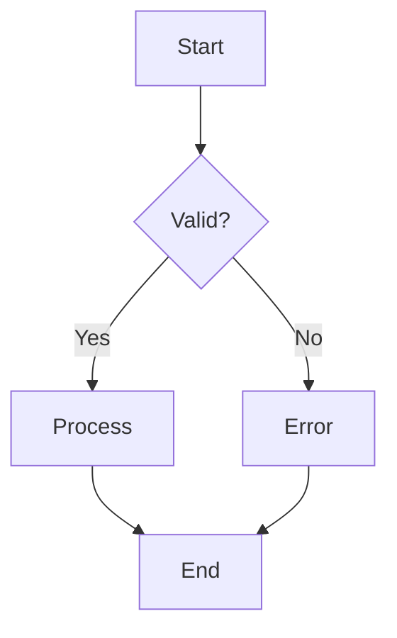
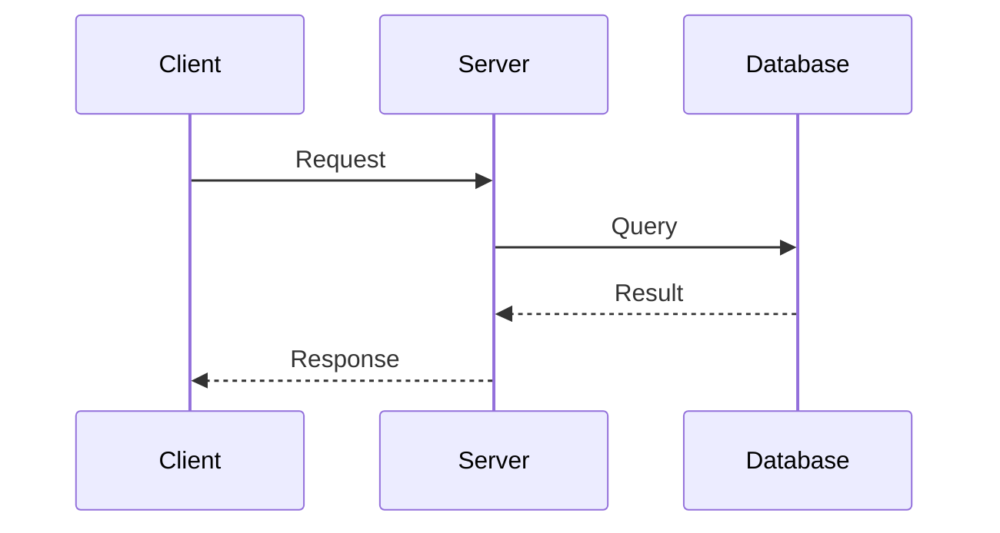
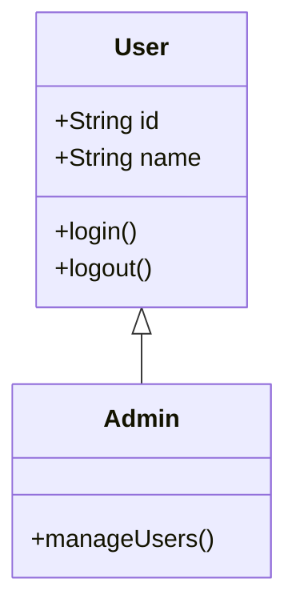
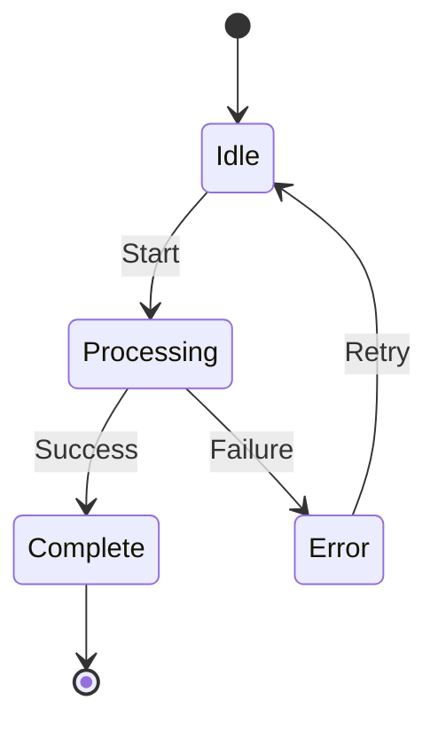
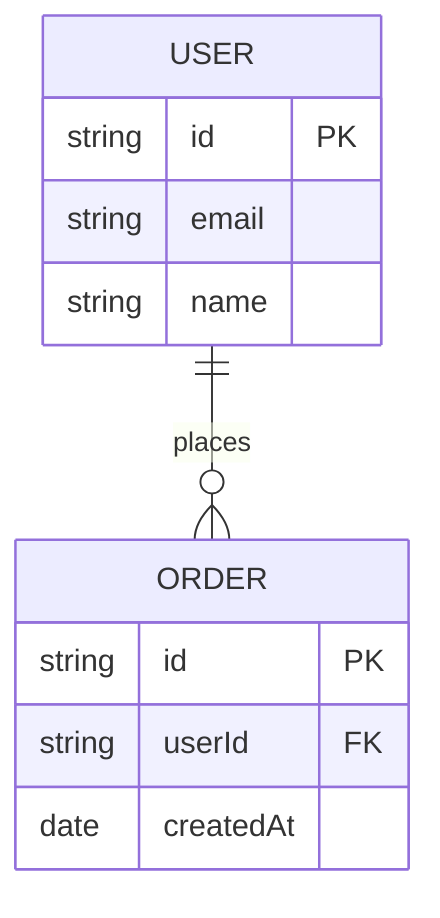
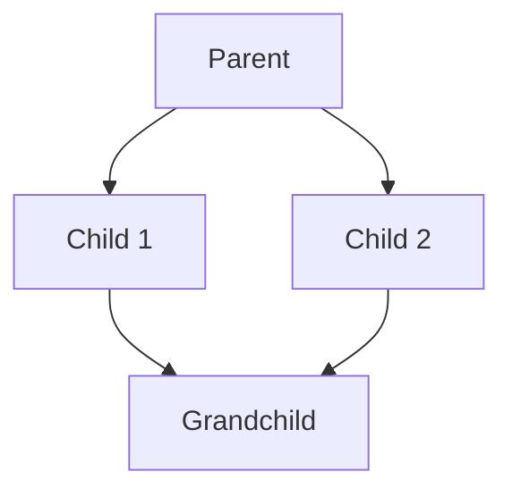
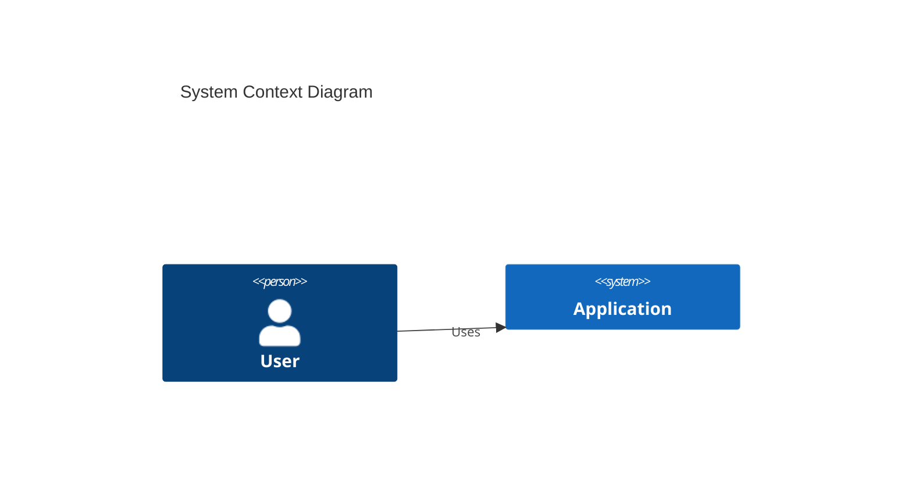
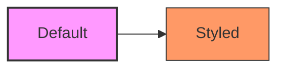

# Mermaid Diagrams

Mermaid allows creating diagrams using text and code, making version control and maintenance easy. It is the core visualization tool for DeepWiki documentation.

## Flowchart

Used to show processes and decision points.



**Syntax:**

```markdown
flowchart TD
    A[Start] --> B{Valid?}
    B -->|Yes| C[Process]
    B -->|No| D[Error]
```

## Sequence Diagram

Used to show interactions between entities over time.



**Syntax:**

```markdown
sequenceDiagram
    participant A as Client
    participant B as Server
    A->>B: Message
    B-->>A: Reply
```

## Class Diagram

Used to show class hierarchies and relationships.



## State Diagram

Used to show state machines and transitions.



## ER Diagram (Entity Relationship)

Used to show database entity relationships.



## Relationship Graph

Used for general directed or undirected relationships.



Direction options:

- `TB` - Top to Bottom
- `BT` - Bottom to Top
- `LR` - Left to Right
- `RL` - Right to Left

## C4 Diagram

Used for software architecture (requires C4 extension).



## Diagram Best Practices

1. **Keep it simple** - One concept per diagram
2. **Use consistent naming** - Match code naming
3. **Add titles** - Explain what the diagram shows
4. **Limit complexity** - Split when exceeding 10-15 elements
5. **Use subgraphs** - Group related elements

## Common Symbols

| Shape | Syntax | Usage |
|-------|--------|-------|
| Rectangle | `[Text]` | Process, step |
| Diamond | `{Text}` | Decision |
| Circle | `((Text))` | Start/End |
| Database | `[(Text)]` | Data storage |
| Subroutine | `[[Text]]` | Predefined process |

## Style Customization

Apply custom styles:



<!--
Source references:
- https://mermaid.js.org/intro/
- https://mermaid.js.org/syntax/flowchart.html
-->
