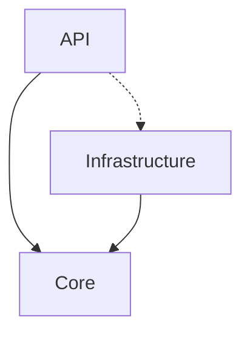
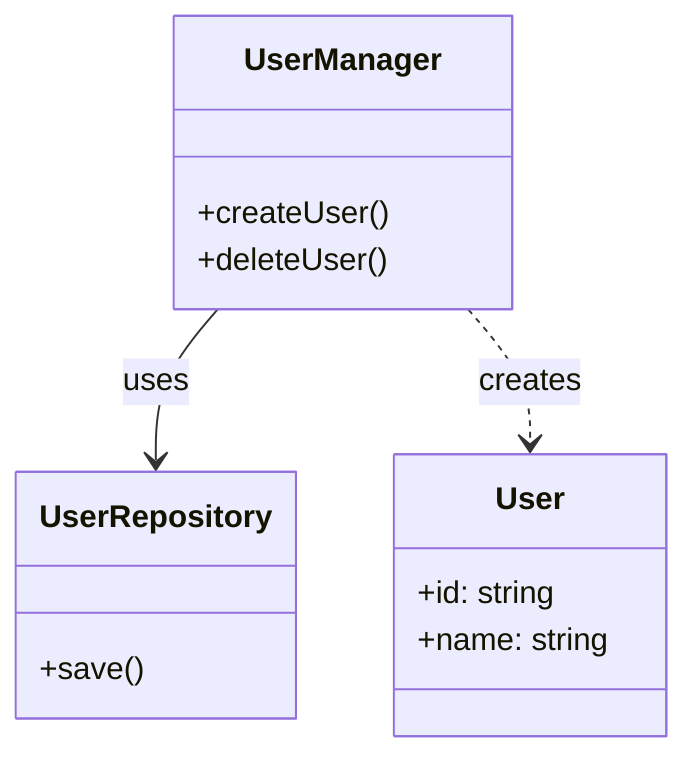
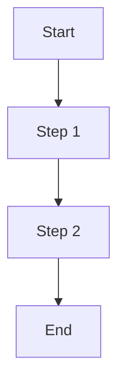

# DeepWiki Documentation Templates

This file contains DeepWiki standard documentation structure output templates. Agents should strictly follow these template structures when generating documentation.

## overview.md (Project Overview)

```markdown
# Project Overview

## What It Is
One-sentence description of the project's core value.

## Tech Stack

| Category | Technology |
|----------|------------|
| Language | TypeScript |
| Framework | Vue 3 |
| Build | Vite |
| Testing | Vitest |

## Directory Structure

```
src/
├── core/           # Core domain logic
├── api/            # Interface layer
├── infra/          # Infrastructure
└── utils/          # Utility functions
```

## Entry Points

- **Main Entry**: `src/main.ts`
- **CLI**: `src/cli.ts`
- **Config**: `vite.config.ts`

## Quick Start

```bash
# Install dependencies
pnpm install

# Development
pnpm dev

# Build
pnpm build
```
```

## architecture.md (Architecture Design)

```markdown
# Architecture Design

## Architecture Style
[Layered Architecture / Hexagonal Architecture / Microkernel / Event-Driven, etc.]

## System Layers (System Decomposition)

### Subsystem A
- **Responsibility**: [Description]
- **Contains Modules**: Module 1, Module 2

### Subsystem B
- **Responsibility**: [Description]
- **Contains Modules**: Module 3

## Module Responsibilities

### Core (Core Layer)
**Responsibility**: Domain logic, business rules
**Boundary**: Does not depend on external services, only interacts with externals through interfaces

### API (Interface Layer)
**Responsibility**: HTTP interfaces, request handling
**Boundary**: Only depends on Core, converts external requests to domain operations

### Infrastructure (Infrastructure Layer)
**Responsibility**: Database, cache, external service clients
**Boundary**: Implements interfaces defined by Core

## Dependencies



> Solid line = Direct dependency, Dashed line = Indirect dependency through interface

## Key Abstractions

| Abstraction | Location | Purpose |
|-------------|----------|---------|
| Repository | core/ports | Data access interface |
| UseCase | core/usecases | Business use cases |
```

## modules/[module-name].md (Module Documentation)

```markdown
# [Module Name]

## Purpose

[Explain why this module exists, what problem it solves]

## Position and Boundary

- **Position in System**: [Description]
- **Responsibility Boundary**:
  - ✅ Does: [Responsibility 1]
  - ❌ Does NOT: [Non-responsibility 1]
- **Dependencies**:
  - Depends on: [Module A], [Module B]
  - Depended by: [Module C]

## Core Files

| File | Responsibility |
|------|----------------|
| `index.ts` | Module entry, exposes public API |

## Key Entities and Semantic Graph

> Describe core classes/interfaces and their relationships



### [Core Class/Interface Name]

- **Design Intent**: [Why is this class needed?]
- **Key Logic**: [Core algorithm or state flow]
- **Usage Notes**: [Parameter constraints, side effects, etc.]

## Usage

### Typical Scenarios

```typescript
// Example code
```

### When to Modify

- When [scenario 1]
- When [scenario 2]
```

## flows.md (Flow Documentation)

```markdown
# Flow Overview

## Main Flow: [Name]

### Flowchart



### Key Step Explanations

1. **Step 1**: [Explanation]
2. **Step 2**: [Explanation]

## Other Flows

### [Flow Name]

[Description]
```

## design-decisions.md (Design Decisions)

```markdown
# Design Decisions

## 1. [Decision Name]

**Status**: Decided / Under Discussion
**Certainty**: High / Medium / Low

### Context

### Decision

### Alternatives

### Trade-offs
```
