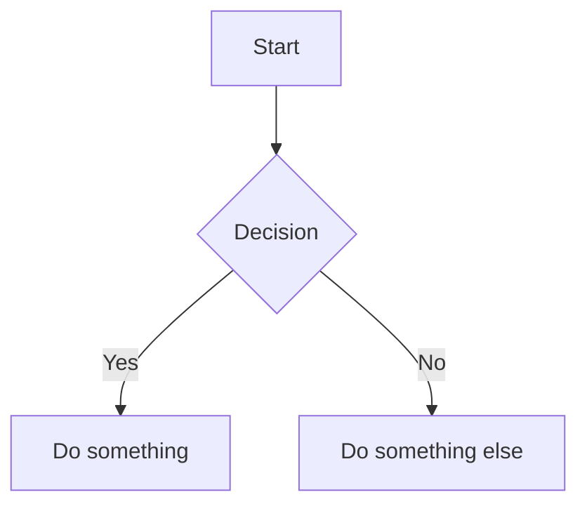

# VitePress Markdown Migration

Migrate existing Markdown documents to VitePress with correct routing, navigation, and diagram rendering.

## Before Starting

**Critical Decision Required**: Choose integration mode once at the start. This decision is final.

### Mode A: Structure-Preserving
- Existing directory structure maps directly to VitePress routes
- Lowest migration risk
- Best for: Personal knowledge bases, Obsidian exports, internal documentation

### Mode B: Structure-Redesign
- Original structure is discarded
- Content reorganized into new information architecture
- Best for: Product documentation, public-facing docs

## Migration Workflow

### Step 0: Select Integration Mode (One-Time)

Ask the user to choose exactly one mode:
- **Mode A**: Preserve existing directory structure
- **Mode B**: Redesign documentation architecture

⚠️ Rules:
- Exactly one mode must be selected
- Do NOT mix modes
- Do NOT switch modes mid-migration

### Step 1: Execute Based on Selected Mode

#### Mode A: Structure-Preserving Mapping

Rules:
- Directory structure defines routing
- `README.md` or `index.md` maps to directory root
- File path equals final URL path

Example:
```
docs/guide/intro.md  → /guide/intro
docs/guide/README.md → /guide/
```

Constraints:
- Do not split or merge content initially
- Normalize filenames only when necessary (spaces, special characters)

#### Mode B: Content Reorganization

Process:
1. Design target information architecture first
2. Treat existing Markdown files as raw content units
3. Reassign each file into new structure

Example target structure:
```
docs/
├─ getting-started/
├─ core-concepts/
├─ advanced/
└─ reference/
```

Rules:
- One Markdown file = one clear topic
- Merging or splitting files is allowed
- Prefer deeper, intentional hierarchies

### Step 2: Normalize Markdown Content

Mandatory checks:
- Exactly one top-level `#` heading per file
- No skipped heading levels
- Remove/convert non-standard syntax:
  - `[[wiki links]]`
  - `![[embedded images]]`

Asset rules:
- All image paths must be relative
- All assets must resolve correctly after migration

Use the detection script to identify issues:
```bash
python3 scripts/detect_issues.py <source-dir>
```

### Step 3: Flowcharts and Mermaid Rendering (Critical)

**Mandatory**: All diagrams MUST use standard Mermaid syntax.

Correct format:


Rules:
- Use fenced code blocks with `mermaid` language identifier
- Do NOT use ASCII diagrams
- Do NOT use Obsidian-specific Mermaid extensions

Validation:
```bash
npm run docs:dev
# Verify all diagrams render correctly
```

### Step 4: Frontmatter Strategy

Optional but recommended for:
- Page titles differing from filenames
- Custom sidebar labels
- SEO or metadata needs

Example:
```md
---
title: Custom Page Title
description: Page description for SEO
---
```

Rules:
- Recommended for index/entry pages
- Optional for leaf pages
- Keep fields minimal

### Step 5: Sidebar Configuration

Choose based on selected mode:

**Option A: Auto-Generated** (Mode A)
- Sidebar derived from directory structure
- File system is single source of truth

**Option B: Curated** (Mode B)
- Explicitly defined sidebar
- Allows reordering, grouping, hiding

Configure in `.vitepress/config.ts`:
```typescript
sidebar: {
  '/guide/': [
    {
      text: 'Guide',
      items: [
        { text: 'Introduction', link: '/guide/' },
        { text: 'Getting Started', link: '/guide/getting-started' }
      ]
    }
  ]
}
```

### Step 6: Images and Assets Organization

Recommended pattern:
```
docs/topic/
├─ index.md
└─ images/
   └─ example.png
```

Usage:
```md

```

Rules:
- Images live close to content they support
- Avoid global asset directories

### Step 7: Legacy Content Cleanup

Common issues:
- Multiple H1 headings
- Absolute local file paths
- Inline HTML with legacy CSS

Use the cleanup script:
```bash
python3 scripts/cleanup.py <source-dir> <output-dir>
```

Detection checklist:
- [ ] Empty headings
- [ ] Broken links
- [ ] Non-relative asset paths
- [ ] Wiki-style links `[[...]]`
- [ ] Embedded image syntax `![[...]]`

### Step 8: Post-Migration Validation

Minimum validation:
1. Run `vitepress dev`
2. Navigate full sidebar
3. Confirm no 404 routes
4. Spot-check:
   - [ ] Mermaid diagrams render
   - [ ] Images display correctly
   - [ ] Tables format properly
   - [ ] Code blocks have syntax highlighting

## Reference Materials

- **Detailed migration patterns**: See [references/migration-patterns.md](references/migration-patterns.md)
- **Mermaid syntax guide**: See [references/mermaid-guide.md](references/mermaid-guide.md)
- **VitePress configuration**: See [references/vitepress-config.md](references/vitepress-config.md)
