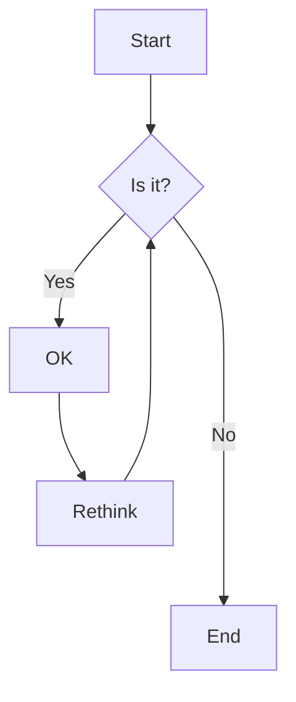
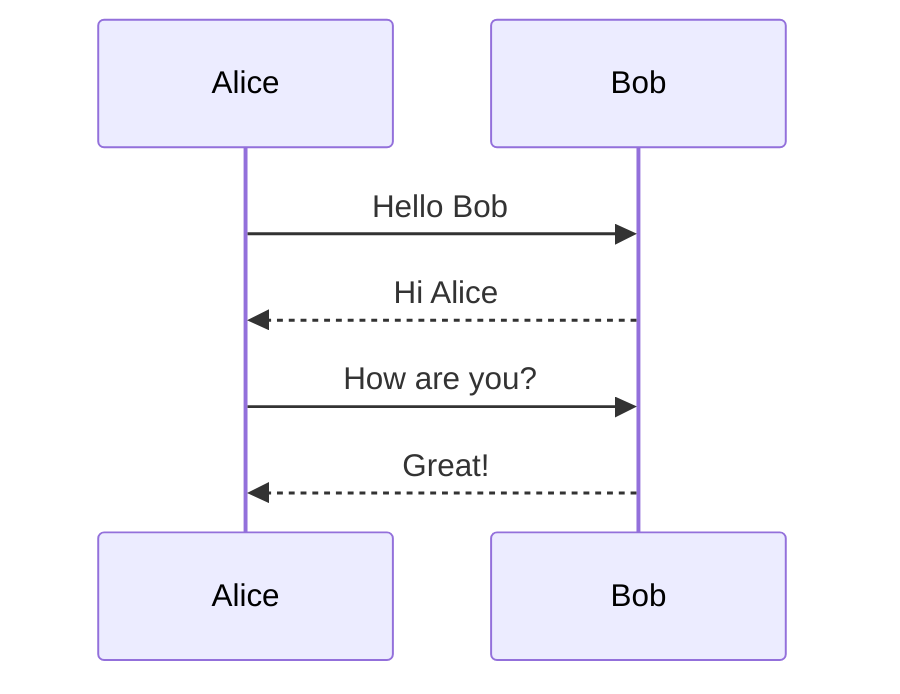
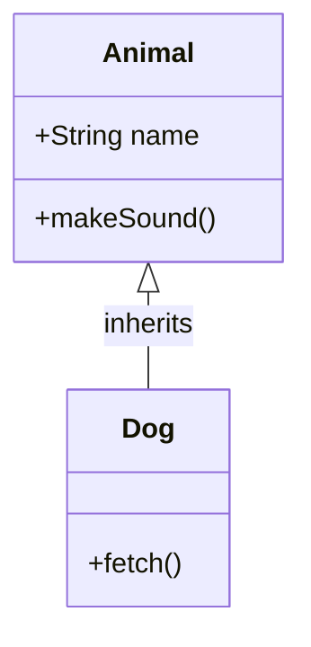
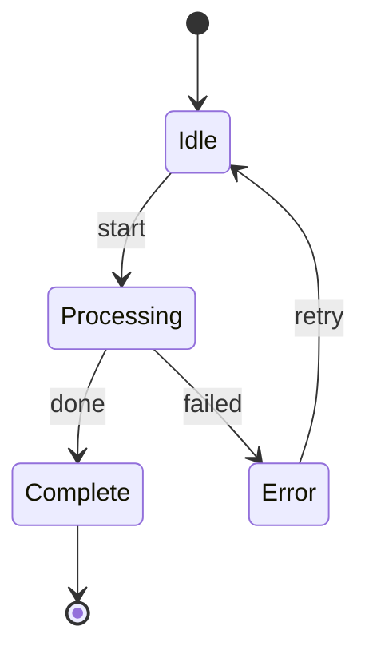
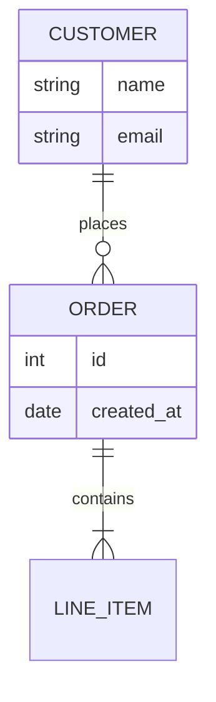
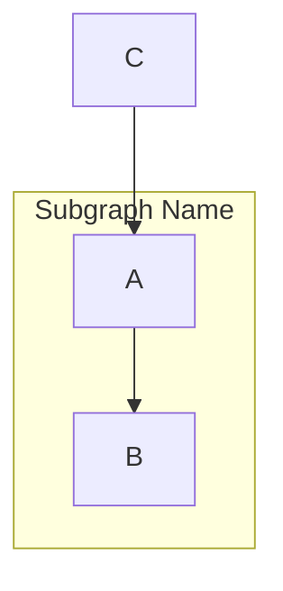
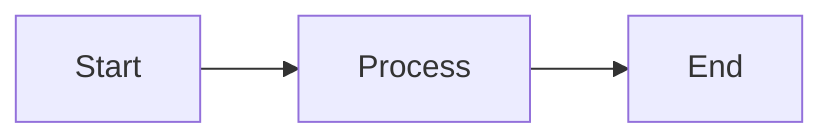

# Mermaid Syntax Guide for VitePress

## Supported Diagram Types

### Flowchart



**Key points:**
- Use `flowchart` (not `graph`)
- Directions: `TD`/`TB` (top-down), `LR` (left-right), `RL`, `BT`
- Arrows: `-->` (solid), `-.->` (dotted), `==>` (thick)
- Labels: `|label|` on arrows

### Sequence Diagram



**Key points:**
- Use `participant` to define actors
- Arrows: `->>` (solid), `-->>` (dotted), `->>+` (activate), `-->>-` (deactivate)
- Aliases: `participant A as Long Name`

### Class Diagram



### State Diagram



### Entity Relationship



## Common Issues and Solutions

### Issue 1: Obsidian-Specific Syntax
Obsidian supports some non-standard Mermaid extensions that won't work in VitePress.

**Not supported:**
- Click events with JavaScript
- Custom CSS styling
- Obsidian-specific directives

**Solution:** Use standard Mermaid syntax only.

### Issue 2: Special Characters
```mermaid
# Wrong
flowchart TD
    A[Text with (parentheses)] --> B

# Correct
flowchart TD
    A["Text with (parentheses)"] --> B
```

Use quotes for text containing special characters.

### Issue 3: Long Text
```mermaid
# Wrong
flowchart TD
    A[This is a very long text that might cause layout issues]

# Correct
flowchart TD
    A["This is a very long text<br/>that wraps nicely"]
```

Use `<br/>` for line breaks in long text.

### Issue 4: Subgraphs


Subgraphs work but avoid deep nesting (max 2-3 levels).

## Syntax Validation Checklist

- [ ] Code block uses `mermaid` language identifier
- [ ] No HTML comments inside diagram
- [ ] No CSS styling directives
- [ ] Special characters quoted
- [ ] Arrow syntax is standard (`-->`, not `===>`)
- [ ] No semicolons at end of lines
- [ ] Consistent indentation (2-4 spaces)

## VitePress Configuration

Enable Mermaid in VitePress:

```typescript
// .vitepress/config.ts
import { defineConfig } from 'vitepress'
import { withMermaid } from 'vitepress-plugin-mermaid'

export default withMermaid(defineConfig({
  // ...config
  mermaid: {
    theme: 'default',
    themeVariables: {
      // Custom colors if needed
    }
  }
}))
```

Install plugin:
```bash
npm install vitepress-plugin-mermaid
```

## Testing Diagrams

Always test diagrams locally:

1. Run dev server: `npm run docs:dev`
2. Navigate to page with diagrams
3. Check browser console for errors
4. Verify rendering in different viewport sizes
5. Check mobile rendering if applicable

## Migration from ASCII Diagrams

### Before (ASCII)
```
┌─────────┐     ┌─────────┐
│  Start  │────▶│ Process │
└─────────┘     └────┬────┘
                     │
                     ▼
               ┌─────────┐
               │   End   │
               └─────────┘
```

### After (Mermaid)

